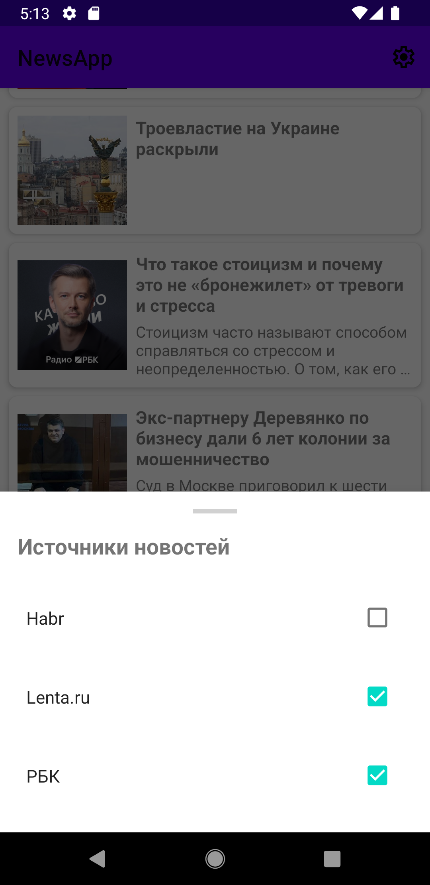

# NewsApp — Агрегатор новостей с поддержкой RSS и Room

Приложение для чтения новостей из различных источников. Реализовано с акцентом на чистую архитектуру и оффлайн-режим.

## 🚀 Основные возможности
* **RSS Parsing:** Загрузка и обработка новостей из кастомных RSS-лент.
* **Source Management:** Система выбора источников новостей через BottomSheet.
* **Offline Mode:** Кеширование статей в локальную базу данных для чтения без интернета.

## 🛠 Стек технологий и библиотеки
* **Language:** Kotlin (Coroutines + Flow)
* **UI:** XML + ViewBinding
* **Architecture:** MVVM + MVI + Clean Architecture (Data, Domain, Presentation)
* **DI:** Hilt (Dagger-Hilt) для внедрения зависимостей
* **Database:** Room (хранение выбранных источников и статей)
* **Network:** Retrofit 2 + OkHttp + XML Parsing
* **Jetpack:** ViewModel, Navigation Component, ViewBinding

## 🏗 Архитектура
Проект построен по принципам **SOLID** и **Clean Architecture**:
1. **Data layer:** Репозитории, Room DAO и сетевые сервисы.
2. **Domain layer:** Use Cases для бизнес-логики (получение списка новостей, фильтрация).
3. **Presentation layer:** ViewModels с использованием StateFlow для обновления UI.

## 🚀 Особенности реализации
* Обработка ошибок сети через кастомный Result.
* Unit-тесты для UseCases и ViewModel.

## 📸 Как это выглядит

  
  
  

