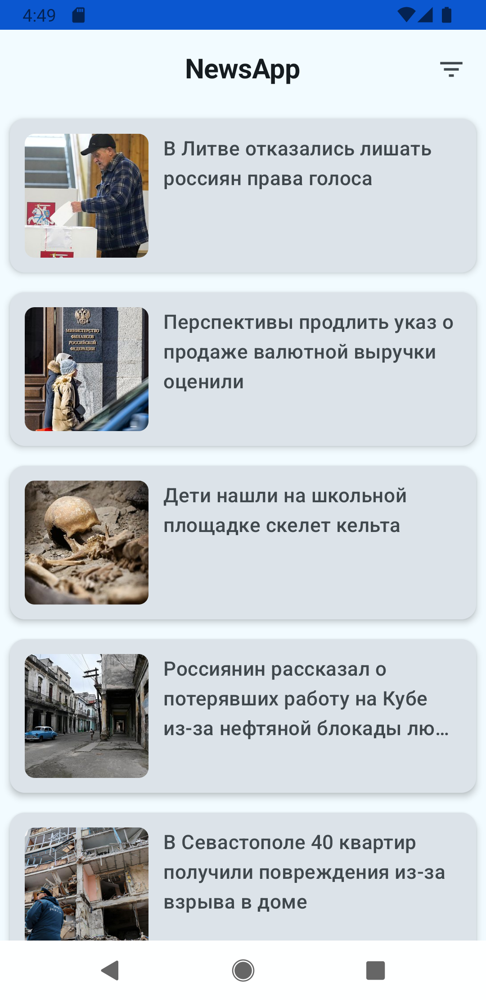
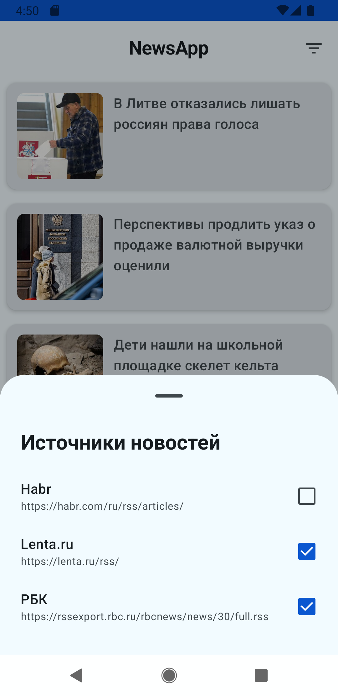
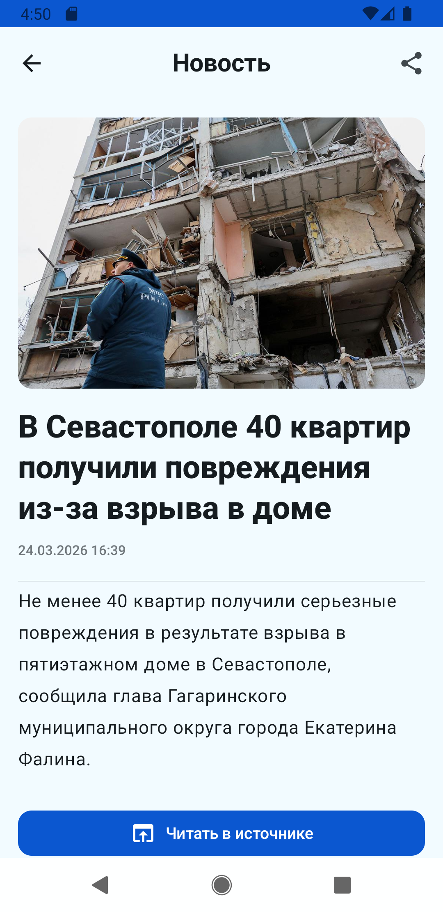

# NewsApp — Агрегатор новостей (RSS + Clean Architecture)

Современное Android-приложение для чтения новостей из различных RSS-источников. Проект построен на стеке Jetpack Compose с соблюдением принципов чистой архитектуры и оффлайн-режима.

## 🚀 Основные возможности
* **RSS Parsing:** Загрузка и автоматическая обработка новостей из гибко настраиваемых RSS-лент (используется `prof18:rss-parser`).
* **Source Management:** Управление источниками новостей через удобный интерфейс (включение/выключение конкретных лент).
* **Offline First:** Кеширование всех статей в локальную базу данных Room. Новости доступны для чтения даже без подключения к интернету.
* **Smart Cache:** Автоматическая очистка старых новостей по истечении заданного порога времени.

## 🛠 Стек технологий
* **UI:** Jetpack Compose (Material 3)
* **Navigation:** Compose Navigation
* **Image Loading:** Coil 3 (с поддержкой сетевых запросов через OkHttp)
* **Architecture:** Clean Architecture + MVVM + MVI (State management через StateFlow)
* **DI:** Hilt (Dagger-Hilt)
* **Database:** Room (DAO, Entities, Flow integration)
* **Network:** OkHttp + RSS Parser
* **Logging:** Timber
* **Async:** Kotlin Coroutines + Flow (включая `collectAsStateWithLifecycle`)

## 🏗 Архитектура
Проект строго разделен на слои согласно принципам **SOLID** и **Clean Architecture**:
1. **Data layer:** Реализация репозиториев, работа с сетевыми источниками и Room. Маппинг сущностей БД в доменные модели.
2. **Domain layer:** Чистая бизнес-логика. Содержит Use Cases (интеракторы) и интерфейсы репозиториев.
3. **Presentation layer:** UI на Jetpack Compose. ViewModel используют Use Cases и управляют состоянием экрана (ViewState).

## 🚀 Особенности реализации
* **Generic Result:** Обработка ошибок через кастомный `SealedResult`.
* **Resource Provider:** Динамическая подгрузка строковых ресурсов в ViewModel через обертку `UiText`.
* **Testing:** Покрыто Unit-тестами (UseCases, ViewModels) с использованием `MockK` и `Turbine`.

## 📸 Скриншоты

  
  
  

